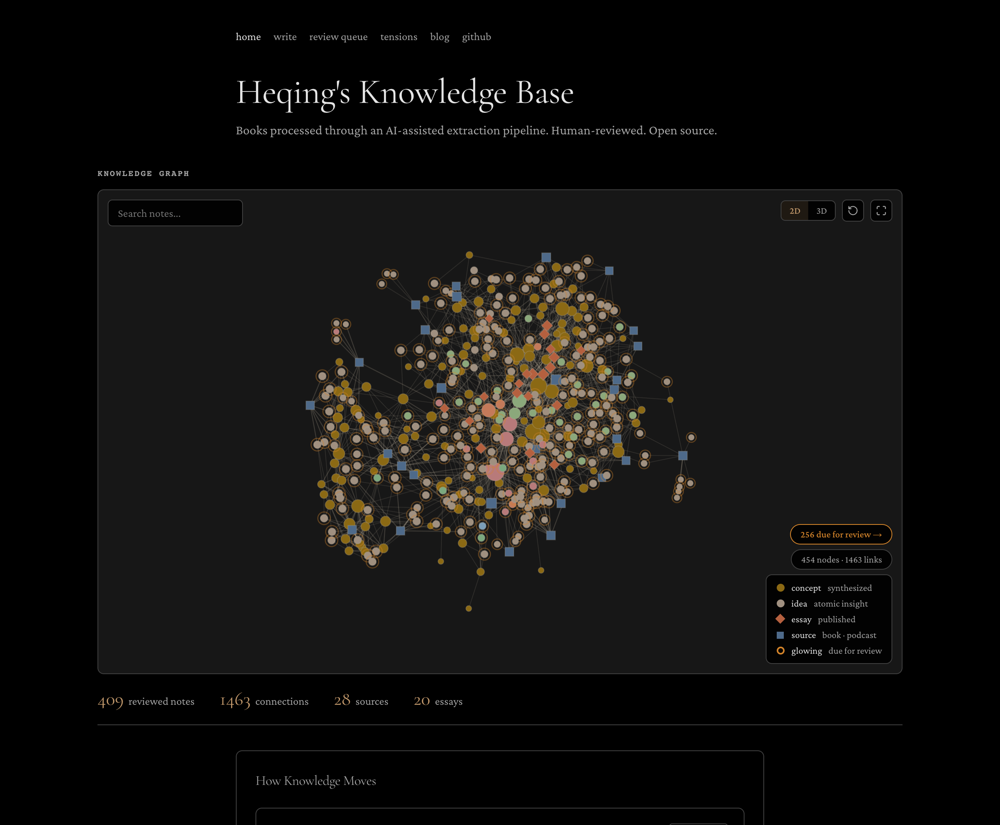
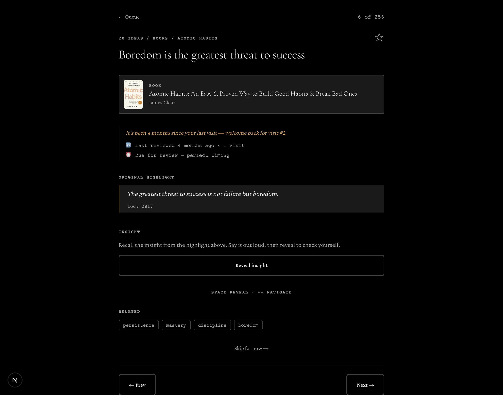
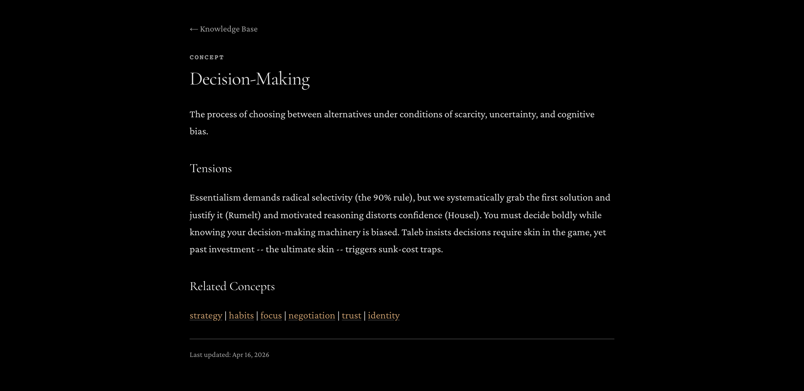

# Building a Second Brain

**Turn everything you read, watch, and hear into a living, interconnected knowledge graph — with AI doing the extraction and you doing the thinking.**

An open-source pipeline + web app that ingests books, podcasts, and articles, uses an LLM to pull out atomic ideas, links them into cross-source concepts, and resurfaces them for spaced-repetition review. You stay the bottleneck on purpose: AI extracts, you review, knowledge compounds.

[](https://second-brain.heqinghuang.com)
[](./LICENSE)
[](https://nextjs.org)
[](#contributing)

**▶ Live demo:** [second-brain.heqinghuang.com](https://second-brain.heqinghuang.com) — a real second brain built from 150+ books.

<!-- screenshots:start -->
<p align="center">
  <br>
  <em>The homepage: every concept, idea, source, and essay in one force-directed graph (2D/3D). Notes due for review glow. Stats are live.</em>
</p>
<p align="center">
  <br>
  <em>A review card — the source front and center, the idea's life story, the original highlight, and the insight hidden until you recall it. This is where knowledge actually sticks.</em>
</p>
<p align="center">
  <br>
  <em>A concept page — one definition, the tensions between sources (Rumelt, Housel, Taleb), and links out. The cross-source synthesis is the whole point.</em>
</p>
<!-- screenshots:end -->

---

## Why this exists

You read a great book. Three months later you remember… that it was good. The highlights rot in an app you never reopen. **Reading without a system is entertainment, not learning.**

This is a system. It's not a read-later app and not a note-taking app — it's a pipeline that turns consumption into a compounding asset:

- **AI does the tedious part** (reading every highlight, pulling out the atomic ideas) so you can do the valuable part (judging, connecting, internalizing).
- **Nothing counts until you review it.** Every AI-generated idea starts `unreviewed`. Friction is the feature — internalization requires it.
- **Knowledge connects across sources.** A concept like *negotiation* pulls from 7 different books and podcasts. The graph gets denser with everything you consume.
- **It's yours and it's free.** Self-hosted, MIT-licensed, your data in your own private repo. Think *Obsidian Publish + an AI research assistant + Anki*, without the subscriptions.
- **Output, not just storage.** Most knowledge tools hoard. This one pushes toward writing: [`/write`](#tools-for-turning-knowledge-into-output) tells you which concepts you've read enough to write about and hands you a draft brief, [`/tensions`](#tools-for-turning-knowledge-into-output) surfaces where your sources disagree so you can take a side, and review hides the answer so you actually recall it instead of re-reading.

## How it works

```
 Read              Extract            Synthesize          Review            Write
 ----              -------            ----------          ------            -----
 Books         -->  Atomic        -->  Concept       -->  Spaced       -->  Published
 Podcasts           ideas              pages              repetition         essays
 Articles           (AI-generated)     (cross-source)     (you approve)     (your voice)
```

**Sources go in. Ideas come out. Concepts compound. You review. Writing happens.**

1. **Capture** — Drop a URL, a file, or a thought to Claude Code. It fetches the full content into an immutable `10 Notes/` source (Kindle highlights, YouTube transcripts via `yt-dlp`, articles as markdown).
2. **Extract** — An LLM reads the source and pulls 3–10 atomic ideas — one idea per file, each with a direct quote or timestamp back to the original.
3. **Review** — Every AI idea lands `unreviewed`. You approve, contest, or edit. Approved ideas enter a Leitner spaced-repetition cycle (Easy 3× / Medium 2× / Hard 1× interval scaling, capped at 180 days).
4. **Synthesize** — Ideas link into lean concept hub-nodes: a one-sentence definition, the tensions between sources, links to related concepts.
5. **Write** — Original essays in your voice, informed by the concept graph but never generated from it.

## Get started — build your own

Two pieces: **the vault** (your knowledge, an Obsidian folder synced to a private GitHub repo) and **the web app** (this repo, the public viewer + private review UI).

### 1. Set up your vault (the pipeline)

The [`vault-template/`](./vault-template) folder is a ready-to-go starter vault with the full pipeline baked in.

```bash
# copy the template somewhere as your vault, then open it in Obsidian
cp -R vault-template ~/my-second-brain
```

- `CLAUDE.md` — the extraction/synthesis/review pipeline Claude Code runs. Customize the **Topic Vocabulary** to your domains.
- `ISA.md` + `sync.sh` — auto-sync the vault to a **private** GitHub repo via PR (handles the headless-`gh` token + macOS Full Disk Access gotchas for you).
- `00 Meta/` — schema, templates, and a Dataview review dashboard.

Open the vault in Claude Code and say *"extract Atomic Habits"* or paste a URL. See [`vault-template/README.md`](./vault-template/README.md) for the full walkthrough.

### 2. Deploy the web app (the viewer)

[](https://vercel.com/new/clone?repository-url=https%3A%2F%2Fgithub.com%2Fh3qing%2Fbuilding-a-second-brain&env=GITHUB_TOKEN,GITHUB_REPO_OWNER,GITHUB_REPO_NAME,AUTH_PIN_HASH,REVALIDATE_SECRET&envDescription=GitHub%20token%20%2B%20your%20private%20vault%20repo%20%2B%20a%20review%20PIN)

Or run it locally:

```bash
git clone https://github.com/h3qing/building-a-second-brain.git
cd building-a-second-brain
npm install
cp .env.example .env.local   # then fill in the values below
npm run dev
```

```bash
GITHUB_TOKEN=ghp_...              # repo scope, to read your private vault
GITHUB_REPO_OWNER=your-username
GITHUB_REPO_NAME=your-vault-repo
AUTH_PIN_HASH=$2b$10$...          # node -e "require('bcryptjs').hash('your-pin', 10).then(console.log)"
REVALIDATE_SECRET=your-secret
```

The app reads your vault's `main` branch live via the GitHub API and renders it per-request — merge a sync PR and the site updates. Public pages show the graph; `/review` is PIN-gated for you.

## Architecture

```
Books / Articles / Podcasts
        |
        v
  Obsidian Vault                 Claude Code runs the pipeline
  10 Notes/  (raw sources)  ---> 20 Ideas/  (one idea per file)
  00 Meta/   (schema + log)      30 Concept/ (cross-source wiki)
        |                               |
        v                               v
   GitHub (private repo)          second-brain.heqinghuang.com
        ^   auto-synced via PR     /            \
        |                      PUBLIC          PRIVATE
        +--- review decisions   Graph +        Review queue
             committed back      Feed          (PIN-gated)
```

| Layer | What | Tech |
|-------|------|------|
| Source of truth | Obsidian vault | Markdown + YAML frontmatter |
| AI pipeline | Extraction, synthesis, spaced repetition | Claude Code + `CLAUDE.md` |
| Sync | Auto-push to GitHub via PR | Git (detached work-tree) + cron/launchd |
| Web app | Public graph + private review | Next.js 16, Vercel |
| Data | Read vault, write review decisions | GitHub REST API |
| Auth | PIN-protected review pages | bcrypt + HMAC sessions |

### Pages

| Route | Access | Purpose |
|-------|--------|---------|
| `/` | Public | Knowledge graph, pipeline diagram, activity feed |
| `/concepts/[slug]` | Public | Rendered concept page with wikilinks |
| `/ideas/[slug]` | Public | Rendered idea page with source context |
| `/review` | Private | Review queue dashboard |
| `/review/card` | Private | Card-based review with **active recall** (insight hidden until you reveal it) |
| `/write` | Public | Concepts you've reviewed enough to write about |
| `/write/[slug]` | Public | A writing brief: definition, tension, prompt, and source material |
| `/tensions` | Public | Where your sources disagree, framed as "pick a side" |

## Tools for turning knowledge into output

Collecting is the easy half. These close the loop to thinking and writing:

- **Writing briefs (`/write`).** A concept becomes "ready to write" once enough reviewed ideas link to it. Open one and you get the definition, the cross-source tension, a synthesized prompt, and every linked idea (insight + quote), assembled to draft from. Copy as markdown or pull it via API.
- **Active recall (`/review/card`).** Re-reviews hide the insight behind a Reveal button, so you recall it before checking yourself, then rate how well you did (which sets the next spaced-repetition interval). Real recall, not passive re-reading.
- **Tensions (`/tensions`).** A feed of concepts whose sources disagree. Taking a side is how reading turns into writing.

## API

Everything above is also a read-only JSON API, so recall and writing plug into your own workflows (a morning email, a Slack bot, a terminal card, an LLM that quizzes you). Set `RECAP_TOKEN` and pass it as `Authorization: Bearer <token>` (preferred; `?token=` works but can leak via logs).

| Endpoint | Returns |
|----------|---------|
| `GET /api/recap/today` | Items **due** for review today + a couple of reviewed items to rediscover |
| `GET /api/recap/random?n=3&type=concept\|idea` | N random reviewed items |
| `GET /api/recap/tensions?n=3` | Concepts where your sources disagree |
| `GET /api/write/brief?concept=<slug>` | A full writing brief for one concept |

All accept `?format=json` (default), `text`, or `md`. Unset `RECAP_TOKEN` → the endpoints `503` (never serve data open by default).

```bash
# today's recall as a plain-text digest (drop into a cron → email/Slack)
curl -H "Authorization: Bearer $RECAP_TOKEN" \
  "https://your-app.vercel.app/api/recap/today?format=text"

# turn a concept's brief into a first draft
curl -s -H "Authorization: Bearer $RECAP_TOKEN" \
  "https://your-app.vercel.app/api/write/brief?concept=clarity&format=md" \
  | claude -p "Draft this essay in my voice. Take a position; don't summarize."
```

## Key design decisions

- **AI extracts, human reviews.** Every idea starts `unreviewed`. The human is the bottleneck on purpose — internalization requires friction.
- **Atomic ideas, not summaries.** Each idea file is one insight, not a book summary. That's what makes cross-source synthesis possible.
- **Concepts are hub nodes, not content pages.** Backlinks do the heavy lifting; concept pages stay under 20 lines.
- **Sources are immutable.** Raw notes are never modified after capture. Interpretation lives in the extracted layer.
- **Spaced repetition for retention.** Reviewed ideas resurface on a schedule so knowledge compounds instead of fading.

## Contributing

Issues and PRs welcome — especially new source adapters (Readwise, Pocket, RSS), additional review UIs, and deployment guides for other hosts. See the [`good first issue`](https://github.com/h3qing/building-a-second-brain/labels/good%20first%20issue) label to get started.

## Inspired by

- [Karpathy's LLM Wiki](https://gist.github.com/karpathy/442a6bf555914893e9891c11519de94f) — the vault pattern
- [Zettelkasten](https://zettelkasten.de/introduction/) — atomic notes and cross-linking
- [Leitner system](https://en.wikipedia.org/wiki/Leitner_system) — spaced repetition
- [Obsidian](https://obsidian.md) — local-first knowledge management
- [Claude Code](https://claude.ai/claude-code) — AI-assisted extraction and synthesis

## License

MIT — see [LICENSE](./LICENSE). Build your own, make it yours.
